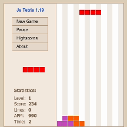
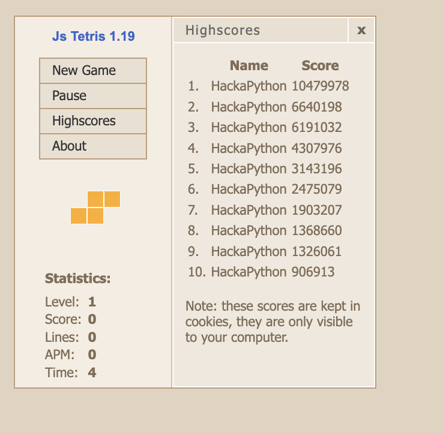
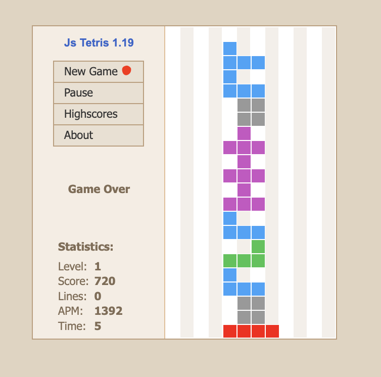
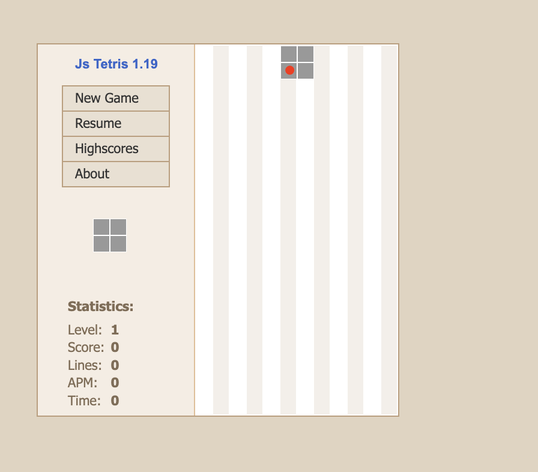
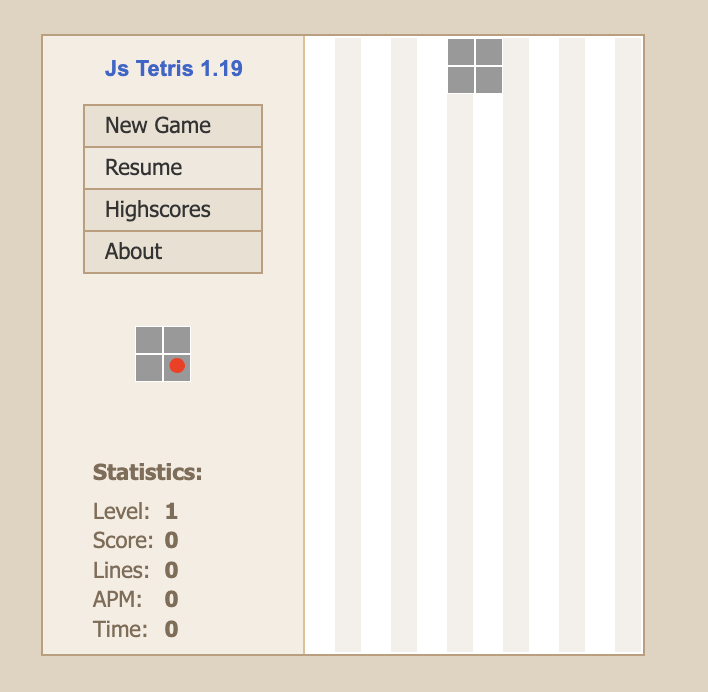
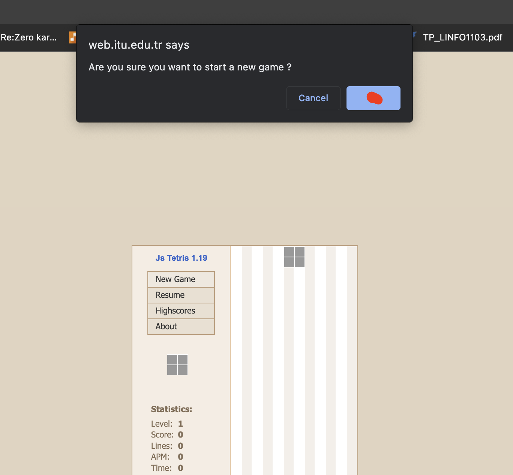
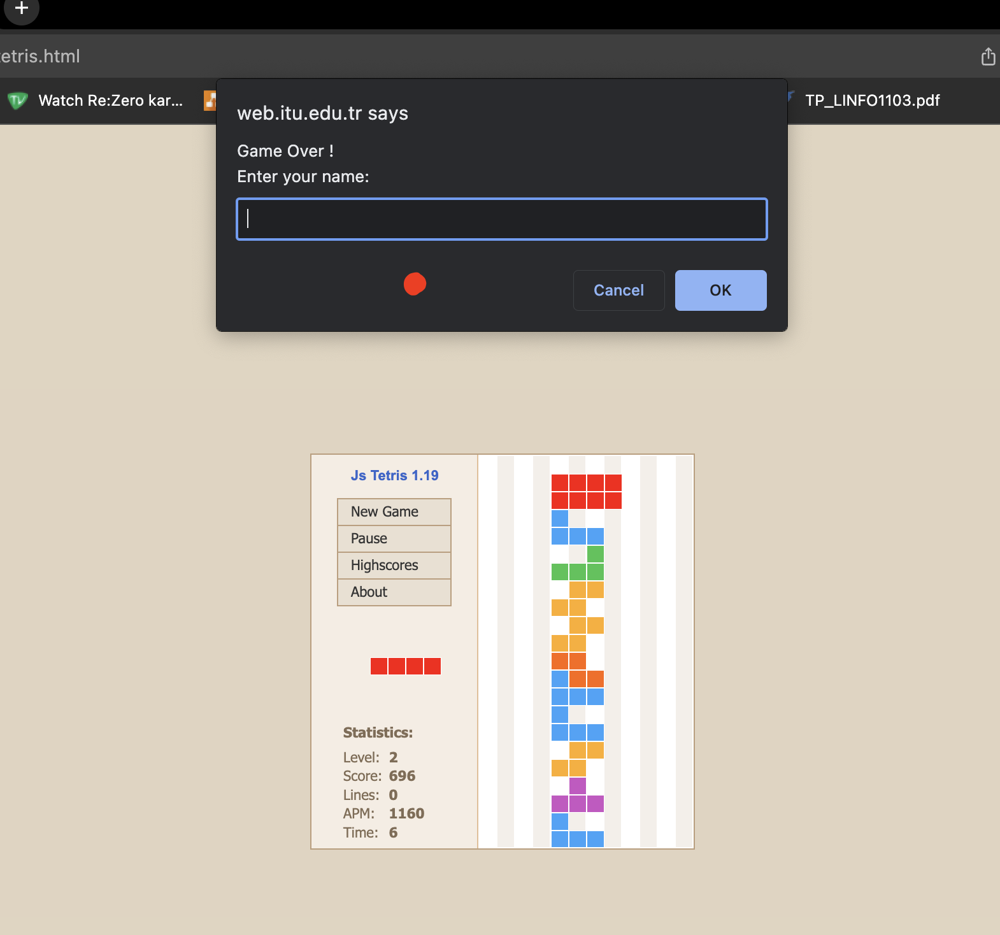

# HackPython - Tetris Bot

### 👑This bot won the 2023 BEST/CECI Hackaton of the Catholic University of Louvain La Neuve👑


https://github.com/thomasdevl/HackaPython/assets/91684310/6ed92fac-ce6c-4dc8-9d36-071ef3f31254


## Description

This is a bot for the game Tetris.
It only works on [this website](https://web.itu.edu.tr/~msilgu/tetris/tetris.html)

## Demo



Our higgest score is 10.5 million points.



## Installation

1. Install Python 3.6 or higher

2. Run the following command in the terminal:

```bash
pip install -r requirements.txt
```
We recommend running a python venv you can find info on how to launch one [here](https://docs.python.org/3/library/venv.html)

## Usage

1. Update the pixel values for the game in the `config.py` file.
### new_game_x, new_game_y


### first_piece_x, first_piece_y


### next_piece_x, next_piece_y


### accept_x, accept_y


### game_over_x, game_over_y 


2. Run the following command in the terminal:

```bash
python3 main.py
```

2*. if you get an error related to the self.color_to_piece dictionnary then you need to update the color values in the config.py.
